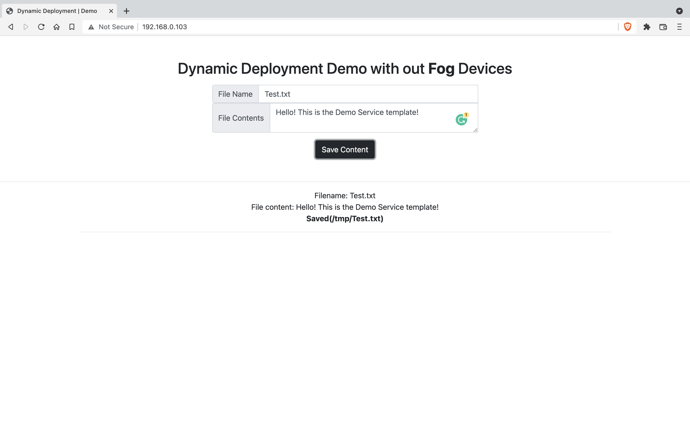

# Fog Service Orchestration
Dynamic Deployment of the services on fog nodes (Raspberry Pi) on the fly with `TOSCA Service Template` and `xOpera` a lightweight orchestrator. 

| Tech Stack | Links |
| --- |:---:|
| Standard | [OASIS TOSCA](https://docs.oasis-open.org/tosca/TOSCA-Simple-Profile-YAML/v1.3/TOSCA-Simple-Profile-YAML-v1.3.html) |
| Orchestrator | [xOpera](https://xlab-si.github.io/xopera-docs/cli.html) |
| Implementation | [Ansible](https://www.ansible.com/) |

## Table of Contents
- [Environment Setup](#environment-setup)
    - [System Native](#system-native) 
    - [Docker](#docker)
- [Orchestration](#orchestration)
- [Orchestration Behind NAT](#orchestration-behind-nat)
- [Service Templates](#service-templates)
- [Node Types](#node-types)
- [Relationship Types](#relationship-types)
- [Supporting Repositories](#supporting-repositories)
- [License](#license)

## Environment Setup
---
### System Native
---
### Install dependencies
```bash
sudo apt install python3-venv python3-wheel python-wheel-common
```
### Create Virtual Environment
```bash
python3 -m venv .venv
```
### Activate
Activate python virtual environment
```bash
source .venv/bin/activate
```
### Install Orchestrator
The xOpera orchestrator tool is available on [`PyPI`](https://pypi.org/project/opera/).
```bash
pip install opera==0.6.8
```
### Generate SSH Key Pair
The system running orchestrator should be able to login into each fog device through SSH without a password. So, generate SSH key pair and copy the public key to all other nodes.
```bash
ssh-keygen
```
### Copy the Public Key
```bash
ssh-copy-id root@192.168.0.XXX
```
### Set Environment Variable
By default xOpera login as `centos` username. To change the login username set the `OPERA_SSH_USER` environment variable. All the fog node's usernames should be the same.
```bash
export OPERA_SSH_USER=root
```

<br>

### Deactivate
Deactivate python virtual environment
```bash
deactivate
```

---
### Docker
---
- Install [Docker](https://docs.docker.com/engine/install/)
- Start `orchestrator` container (`ARM64/AMD64` only)
```bash
docker container run \
-v ~/.ssh:/root/.ssh \
-it --rm suvambasak/orchestrator:latest \
"bash"
```

## Orchestration
TOSCA Sevice Template validation, deployment, and undeployment with `xOpera`. Check out `xOpera CLI` documentation [here](https://xlab-si.github.io/xopera-docs/02-cli.html).

<br>

Deploying demo template `service-0.yaml` developed for realizing Dynamic Deployment without fog devices (works with Personal Computers/Virtual Machine running Linux).

### Validate
Validate TOSCA Service Templates <br>
`-e`: executors (Ansible Playbooks) behind them <br>
`-i`: Input file 
```bash
opera validate -e -i inputs.yaml service-0.yaml 
```
Validation should look like this if nothing is wrong.
```bash
(.venv) dex@Suvams-Air tosca % opera validate -e -i inputs-0.yaml service-0.yaml 
Validating service template...
[Worker_0]   Validating fog-node-1_0
[Worker_0]   Validation of fog-node-1_0 complete
[Worker_0]   Validating fog-node-2_0
[Worker_0]   Validation of fog-node-2_0 complete
[Worker_0]   Validating docker-swarm-leader_0
[Worker_0]     Executing create on docker-swarm-leader_0
[Worker_0]     Executing delete on docker-swarm-leader_0
[Worker_0]   Validation of docker-swarm-leader_0 complete
[Worker_0]   Validating docker-swarm-worker-1_0
[Worker_0]     Executing create on docker-swarm-worker-1_0
[Worker_0]     Executing pre_configure_source on docker-swarm-worker-1_0--docker-swarm-leader_0
[Worker_0]     Executing delete on docker-swarm-worker-1_0
[Worker_0]   Validation of docker-swarm-worker-1_0 complete
[Worker_0]   Validating docker-service-1_0
[Worker_0]     Executing create on docker-service-1_0
[Worker_0]     Executing delete on docker-service-1_0
[Worker_0]   Validation of docker-service-1_0 complete
Done.
```
### Deploy
Deploy TOSCA Service Templates <br>
`-i`: Input file <br>
`-w`: Number of concurrent threads
```bash
opera deploy -w 2 -i inputs.yaml service-0.yaml
```
If the deployment of the services is successful.
```bash
(.venv) dex@Suvams-Air tosca % opera deploy -w 2 -i inputs-0.yaml service-0.yaml
[Worker_0]   Deploying fog-node-1_0
[Worker_1]   Deploying fog-node-2_0
[Worker_1]   Deployment of fog-node-2_0 complete
[Worker_0]   Deployment of fog-node-1_0 complete
[Worker_0]   Deploying docker-swarm-leader_0
[Worker_0]     Executing create on docker-swarm-leader_0
[Worker_0]   Deployment of docker-swarm-leader_0 complete
[Worker_1]   Deploying docker-swarm-worker-1_0
[Worker_1]     Executing create on docker-swarm-worker-1_0
[Worker_1]     Executing pre_configure_source on docker-swarm-worker-1_0--docker-swarm-leader_0
[Worker_1]   Deployment of docker-swarm-worker-1_0 complete
[Worker_0]   Deploying docker-service-1_0
[Worker_0]     Executing create on docker-service-1_0
[Worker_0]   Deployment of docker-service-1_0 complete
```
<p align="center">

&nbsp;&nbsp;

</p>

<br>

### Undeploy
Undeploy TOSCA Service Templates <br>
`-w`: Number of concurrent threads
```bash
opera undeploy -w 2
```
If the undeployment of the services is successful.
```bash
(.venv) dex@Suvams-Air tosca % opera undeploy -w 2                              
[Worker_0]   Undeploying docker-service-1_0
[Worker_0]     Executing delete on docker-service-1_0
[Worker_0]   Undeployment of docker-service-1_0 complete
[Worker_0]   Undeploying docker-swarm-worker-1_0
[Worker_0]     Executing delete on docker-swarm-worker-1_0
[Worker_0]   Undeployment of docker-swarm-worker-1_0 complete
[Worker_0]   Undeploying fog-node-2_0
[Worker_1]   Undeploying docker-swarm-leader_0
[Worker_1]     Executing delete on docker-swarm-leader_0
[Worker_0]   Undeployment of fog-node-2_0 complete
[Worker_1]   Undeployment of docker-swarm-leader_0 complete
[Worker_0]   Undeploying fog-node-1_0
[Worker_0]   Undeployment of fog-node-1_0 complete
```

## Orchestration Behind NAT
### Orchestration Manager Node
- Start orchestration manager container
```bash
docker container run -p 80:7890 -it --rm suvambasak/master:latest
```
### Orchestrator Node
- Pick one node under each NAT for the orchestration.
The node must log in to each device in that NAT through SSH without a password (`~/.ssh`)
- Create a file `HOST` and list all the `IP addresses` of the device in that `NAT`
```bash
root@raspberrypi:~# cat /tmp/opera_config/HOST 
192.168.0.184
192.168.0.103
```
- Start the orchestrator container (IP=`52.140.51.137` IP of the Orchestration Manager Node)
```bash
docker container run \
-v ~/.ssh:/root/.ssh \
-v /tmp/opera_config:/root/.config \
-e PORT=80 \
-e IP=52.140.51.137 \
-t suvambasak/orchestrator:latest
```

## Service Templates
| Template Name | Description |
|---|---|
| [service 0](/orchestrator/tosca/service-0.yaml) | Demo Service Template for realizing Dynamic Deployment on VMs/PCs running Linux without IoT hardware. |
| [service 1](/orchestrator/tosca/service-1.yaml) | Deploy remote LED service with privileged containers (actuation). On/Off LEDs from a Webpage. |
| [service 2](/orchestrator/tosca/service-1.yaml) | Deploy remote LED service with System Service (actuation). On/Off LEDs from a Webpage. |

## Node Types
| [Node Types](/orchestrator/tosca/nodetypes) | Description |
|---|---|
| [Docker Containers](/orchestrator/tosca/nodetypes/docker_containers) | Deploy/Undeploy Docker Containers from a `docker-compose.yaml` file. |
| [Docker Services](/orchestrator/tosca/nodetypes/docker_services) | Deploy/Undeploy Docker Stack from a `docker-compose.yaml` file. |
| [Swarm Leader](/orchestrator/tosca/nodetypes/swarm_leader) | Node type for Docker Swarm Leader. |
| [Swarm Worker](/orchestrator/tosca/nodetypes/swarm_worker) | Node type for Docker Swarm Worker. |
| [System Service](/orchestrator/tosca/nodetypes/system_service) | Node type for `systemctl` service. |

## Relationship Types
| [Relationship Types](/orchestrator/tosca/relationshiptypes) | Description |
|---|---|
| [Token Transfer](/orchestrator/tosca/relationshiptypes/token_transfer) | Swarm Worker nodes dependency on Swarm Manager node. |

## Supporting Repositories
| Repository | Description |
|---|---|
| [Docker](https://github.com/cloud-and-smart-labs/docker-images.git) | Dockerfile, Docker-Compose, Python Scripts, and Webpages |
| [Pi System Services](https://github.com/cloud-and-smart-labs/pi-system-service.git) | Service files, Python Scripts, and Configuration files |
| [System setup and utility tools](https://github.com/cloud-and-smart-labs/system-setup-util.git) | System setup and Monitoring tools |

## License
This work is licensed under the [Apache License 2.0](https://www.apache.org/licenses/LICENSE-2.0).
